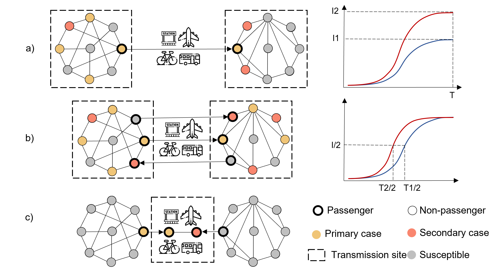
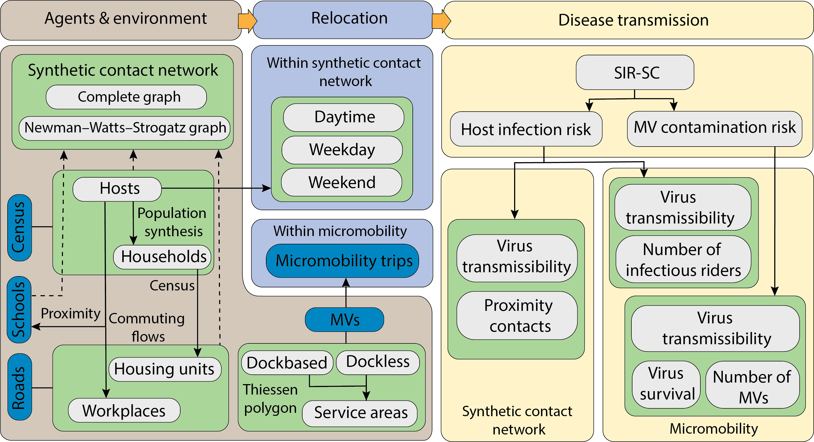

# TranEpiSim: Urban Transportation Epidemic Simulator

Transportation systems can contribute to the spread of diseases by introducing pathogens to new geographic areas, by accelerating their diffusion, or by becoming a disease vector. In many respects, this mirrors the transmission of vector-borne diseases by living vectors such as mosquitoes. The latter role manifests itself within moving vehicles or in facilities where individuals share space with others, thus leading to new contacts that may facilitate disease transmission. TranEpiSim is an agent-based simulator built on top of a synthetic human contact network for Cook County, IL. The current version focuses on a single mode of transportation, micromobility systems, and introduces an agent-based approach that explicitly models a viral disease transmission through the use of micromobility vehicles in an urban area.  



## Table of Contents

- [Technologies Used](#technologies-used)
- [Features](#features)
- [Getting Started](#getting-started)
- [Usage](#usage)
- [Examples](#examples)
- [Documentation](#documentation)
- [Contributing](#contributing)
- [License](#license)
- [Acknowledgments](#acknowledgments)
- [Contact](#contact)

## Technologies Used

- Python 3.10
- graph-tool & networkx
- geopandas & Shapely
- High Performance Computing (HPC)

## Features

- Transmission of viral diseases through fomites on miromobility vehicles and through close proximity in a large scale synthetic human contact network.
- Using actual individual micromobility trips
- Featured with a novel disease transmission model called SIR-SC.
- Built on top of graph-tool suited for fast, large-scale network analysis.



## Getting Started

To get started with TranEpiSim, follow these steps:

1. Clone the repository: `git clone https://github.com/behnamnkp/TranEpiSim.git`
2. Organize directories as represented below
3. Make sure you use the right versions of Python
4. Install the required dependencies in `requirements.txt`
5. Configure the flags and paths in the `.config.json` file. 
6. I have developed multiple notebooks that provide detailed, step-by-step instructions to make it easier for users to utilize the repository.
   1. [Create synthetic human contact network](src/synthetic_human_contact_network.ipynb)
   2. Micromobility and disease spread in population

## Usage
Once you organize files and directories, you will be able to run the code to create the synthetic population and human contact network for Cook County, read micromobility trips, and calculate the dynamics of disease by setting up different scenarios.

## Examples
Please see the following notebooks for Cook County synthetic contact network, miromobility, and disease transmission.
   1. [Create synthetic human contact network](src/synthetic_human_contact_network.ipynb)
   2. [Replicate figures from manuscript](src/figure_replications.ipynb)
   3. Micromobility and disease spread in population(coming soon!)

## Folder structure
```
📁 TranEpiSim
├── 📁 docs
├── 📁 data
│   ├── 📁 cbd
│   ├── 📁 cbp
│   ├── 📁 dp
│   ├── 📁 education
│   ├── 📁 mic_stations
│   ├── 📁 mic_trips
│   ├── 📁 od
│   ├── 📁 replicate_manuscript_figures
│   ├── 📁 road
├── 📁 src
│   ├── 🐍 tran.py
│   ├── 🐍 epi.py
│   ├── 🐍 sim.py
│   ├── 🐍 synthesizer.py
│   ├── 🐍 main.py
│   ├── 🐍 utils.py
│   ├── 📝 synthetic_human_contact_network.ipynb
│   ├── 📝 figure_replications.ipynb
├── 📁 output
├── 📁 plot             
└── 📄 config.json
└── 📄 README.md
└── 📄 Requirements.txt
└── ...
```

## Documentation

A manuscript of the methodology is currently under review. 

## Contributing

To contribute, please follow these steps:

1. Fork the repository
2. Create a new branch: `git checkout -b feature/new-feature`
3. Make your changes and commit them: `git commit -am 'Add new feature'`
4. Push the changes to your forked repository: `git push origin feature/new-feature`
5. Submit a pull request

Please adhere to the [Code of Conduct](CODE_OF_CONDUCT.md) and follow the coding conventions specified in the project.

## License

This project is not licensed yet.

## Acknowledgments

The code for constructing the network was obtained from Talha Oz's Jupyter notebook repository and adapted for the application for disease systems. You can find his repository with wonderful instructions [**here**](https://nbviewer.org/gist/oztalha/a1c167f3879c5b95f721acef791c8111/Population%20Synthesis%20for%20ABM.ipynb). You can also find their paper [**here**](https://dl.acm.org/doi/abs/10.1145/3145574.3145593?casa_token=z6J9RUlCP3UAAAAA:7Ie0L7W9_bmIsaR9JHfutQgyYJ9aIj0dC2ZnuGhQaF4x46QOczVq1FwfH7dsDloAcwDCH26pjOM).

## Contact

For any questions, suggestions, or feedback, please contact me:

- Email: 
- Twitter: 